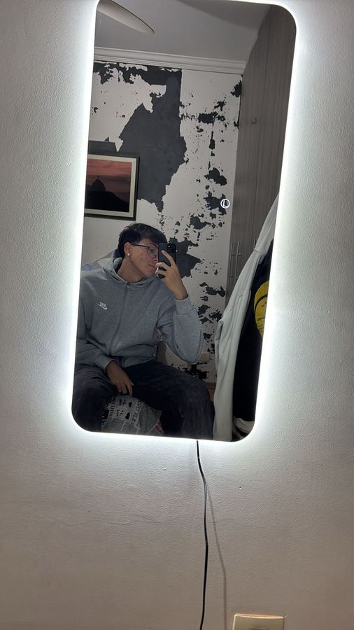

# Lumen AI - Soul UP Challenge 2026

Projeto da equipe para o **Challenge 2026 da FIAP**, disciplina **Front-End Design Engineering**, baseado no **Desafio 3 - Avatar Inteligente e Interativo** da Soul UP.

A **Lumen AI** é uma experiência web gamificada em que a avatar **Lumën** orienta o usuário em missões sustentáveis, apresenta pontos, níveis, progresso e impacto estimado de forma simples e responsiva.


## Links do projeto

- **GitHub:** https://github.com/DioohReis/soul-up-challenge
- **Vídeo no YouTube:** **PENDENTE - adicionar o link público do vídeo da Sprint 03 antes da entrega**

> O link do vídeo não foi inventado neste repositório porque não existe um vídeo de apresentação da Sprint 03 informado nos arquivos atuais.

## Tecnologias utilizadas

- **React 18** - interface e componentização;
- **Vite** - ambiente de desenvolvimento e build;
- **TypeScript** - tipagem dos componentes, dados e formulários;
- **Tailwind CSS** - estilização e responsividade;
- **React Router DOM** - SPA, rotas estáticas e rota dinâmica de integrante;
- **React Hook Form** - validação dos formulários de contato e login;
- **Git e GitHub** - versionamento e colaboração.

Não são utilizados Bootstrap, Material UI, Chakra UI, jQuery, Axios, templates prontos ou outro framework de front-end.

## Páginas e rotas

| Rota | Página | Objetivo |
|---|---|---|
| `/` | Home | Apresentação da Lumen AI e resumo do progresso do usuário. |
| `/sobre` | Sobre | Contexto, problema, solução, tecnologias e roadmap. |
| `/solucao` | Solução | Explicação do fluxo da solução e mockup de progresso. |
| `/experiencia` | Experiência | Quests sustentáveis, filtros, pontuação, níveis e localStorage. |
| `/integrantes` | Integrantes | Lista da equipe e acesso aos perfis. |
| `/integrantes/:rm` | Detalhe do integrante | **Rota dinâmica** usando `useParams`. |
| `/contato` | Contato | Formulário com React Hook Form e validações. |
| `/faq` | FAQ | Perguntas frequentes com estado React. |
| `/login` | Login | Autenticação demonstrativa somente no front-end. |

A aplicação funciona como **SPA (Single Page Application)** e a navegação interna é realizada pelo React Router DOM.

## Requisitos React aplicados

- páginas convertidas para componentes React em `src/pages`;
- componentes reutilizáveis em `src/components`;
- `Header`, `Footer`, `Layout`, `PageHero`, `GlassCard`, `QuestCard`, `Modal`, ícones e avatar reutilizáveis;
- `useState` em diferentes componentes, como menu mobile, FAQ, experiência, formulários e modais;
- `useEffect` para atualização de estado e efeitos ligados à navegação/armazenamento;
- `useNavigate` para navegação programática;
- `useParams` na rota dinâmica `/integrantes/:rm`;
- props tipadas com TypeScript;
- rotas estáticas e dinâmica;
- persistência demonstrativa com `localStorage`, sem API nesta sprint.

## Formulários

Os formulários de **Contato** e **Login** usam `useForm()` do React Hook Form.

O formulário de contato possui:

- nome obrigatório;
- e-mail obrigatório e validado;
- mensagem obrigatória com tamanho mínimo;
- mensagens de erro visíveis;
- tipagem TypeScript;
- feedback visual após envio válido.

Nenhum dado é enviado para API nesta Sprint 03.

## Responsividade

A interface foi construída com Tailwind CSS seguindo abordagem mobile-first e adaptada para:

- **mobile:** até aproximadamente 480px;
- **tablet:** a partir de 768px;
- **desktop:** a partir de 992px.

O menu muda para navegação mobile, grids passam para uma coluna em telas menores e os cards/inputs utilizam larguras fluidas.

## Estrutura de pastas

```text
soul-up-challenge/
├── public/
│   └── image/
│       ├── logo.png
│       ├── fundo.gif
│       └── fotos dos integrantes
├── src/
│   ├── components/
│   │   ├── Footer.tsx
│   │   ├── GlassCard.tsx
│   │   ├── Header.tsx
│   │   ├── Layout.tsx
│   │   ├── LumenMascot.tsx
│   │   ├── Modal.tsx
│   │   ├── PageHero.tsx
│   │   ├── QuestCard.tsx
│   │   ├── ScrollToTop.tsx
│   │   └── SocialIcon.tsx
│   ├── data/
│   │   ├── quests.ts
│   │   └── team.ts
│   ├── pages/
│   │   ├── Contato.tsx
│   │   ├── Experiencia.tsx
│   │   ├── Faq.tsx
│   │   ├── Home.tsx
│   │   ├── IntegranteDetalhe.tsx
│   │   ├── Integrantes.tsx
│   │   ├── Login.tsx
│   │   ├── NotFound.tsx
│   │   ├── Sobre.tsx
│   │   └── Solucao.tsx
│   ├── types/
│   │   └── index.ts
│   ├── utils/
│   │   └── storage.ts
│   ├── App.tsx
│   ├── index.css
│   └── main.tsx
├── docs/
│   └── imagens/
├── GIT_HISTORICO.txt
├── index.html
├── package.json
├── package-lock.json
├── postcss.config.js
├── tailwind.config.ts
├── tsconfig.app.json
├── tsconfig.json
├── tsconfig.node.json
└── vite.config.ts
```

## Como executar localmente

### Pré-requisitos

- Node.js 18 ou superior;
- npm.

### Instalação

```bash
npm install
npm run dev
```

Abra no navegador o endereço exibido pelo Vite.

### Build de produção

```bash
npm run build
npm run preview
```

### Verificação de TypeScript

```bash
npm run typecheck
```

## Como testar as principais funcionalidades

1. Abra a Home e teste o menu em desktop e mobile.
2. Navegue pelas rotas sem recarregar a aplicação.
3. Acesse `/login` e clique em uma conta demonstrativa.
4. Após o login, acesse a experiência e confirme que o nome aparece no plano da Lumën.
5. Escolha um problema ecológico e filtre a dificuldade.
6. Conclua uma quest e confirme o aumento dos pontos e do nível.
7. Recarregue a página e verifique a persistência pelo `localStorage`.
8. Acesse `/integrantes`, abra um perfil e verifique a rota `/integrantes/:rm`.
9. Teste o formulário de contato vazio, com e-mail inválido e depois com dados válidos.
10. Teste as larguras de 390px, 768px e 1440px no DevTools.

## Integrantes

| Foto | Nome | RM | Turma | GitHub | LinkedIn |
|---|---|---:|---|---|---|
|  | Diogo Guilherme | 573301 | 1TDSPF | https://github.com/DioohReis | https://www.linkedin.com/in/diogo-guilherme-de-assis-reis-95b11624b/ |
|  | Gabriel Ricardo | 572279 | 1TDSPF | https://github.com/gabriel-ricardo-ADS | https://www.linkedin.com/in/gabriel-ricardo-lima/ |
|  | Matheus Rodrigues | 570469 | 1TDSPF | https://github.com/MatheusRodriguesSerrao | https://www.linkedin.com/in/matheus-rodrigues-06060a3a6/ |
|  | Luiz Henrique Alves Albarello | 572727 | 1TDSPF | https://github.com/LuizHenriqueAAlbarello | https://www.linkedin.com/in/luiz-henrique-alves-albarello-82297b410/ |
|  | Gabriel Razo | 572244 | 1TDSPF | https://github.com/gabrielrazod9j-ops | https://www.linkedin.com/in/gabriel-razo-dantas-34724b301/ |

## Git e versionamento

- branch principal esperada: `main`;
- repositório: https://github.com/DioohReis/soul-up-challenge;
- o arquivo `GIT_HISTORICO.txt` preserva um resumo do histórico já existente;
- os novos arquivos desta migração devem ser commitados pelos integrantes em branches próprias para manter autoria e participação individual.

> A migração não cria commits artificiais em nome dos integrantes. Cada integrante deve realizar seus próprios commits no GitHub para que o histórico colaborativo seja verificável.

## Imagens e documentação visual

Além das imagens usadas na interface, a pasta `docs/imagens/` mantém registros visuais da evolução do projeto.


## Observações para a entrega

- não enviar `node_modules` no ZIP;
- manter `package.json`, lock file, `src`, `public` e configurações de Vite/TypeScript/Tailwind;
- validar `npm install` e `npm run build` antes de compactar;
- adicionar o link público do vídeo da Sprint 03 no README;
- confirmar que o repositório está acessível durante a correção;
- manter o ZIP abaixo de 50 MB.


### Evoluções visuais da Sprint 03
- Carrossel 3D de integrantes preservado e componentizado em React.
- Avatar Lumën redesenhado com animações e interação, sem biblioteca externa de UI.
