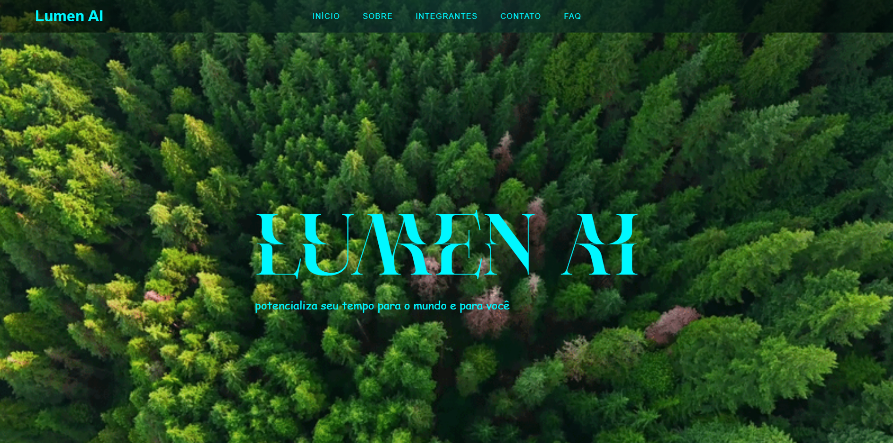
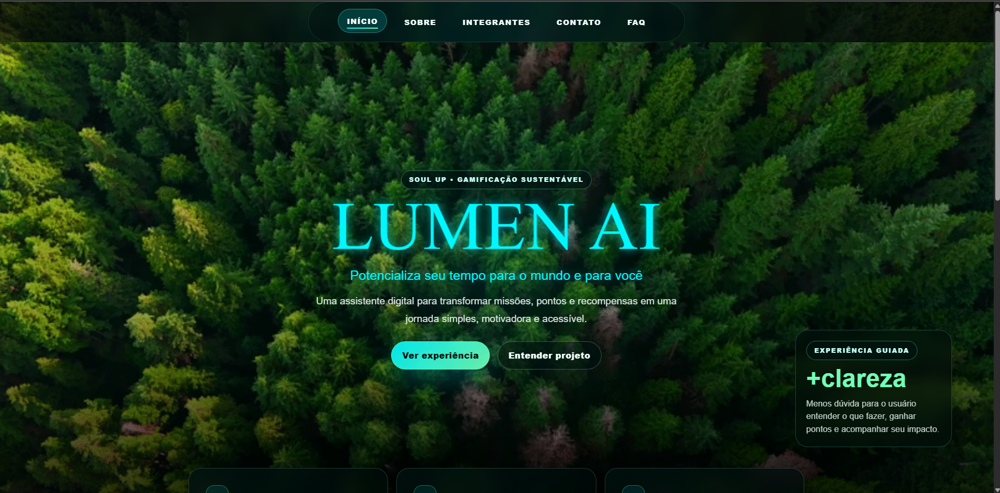
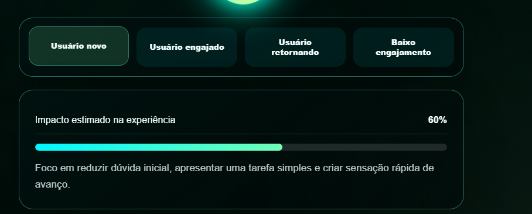
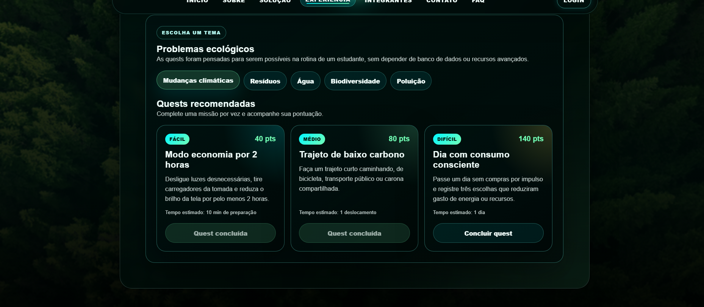
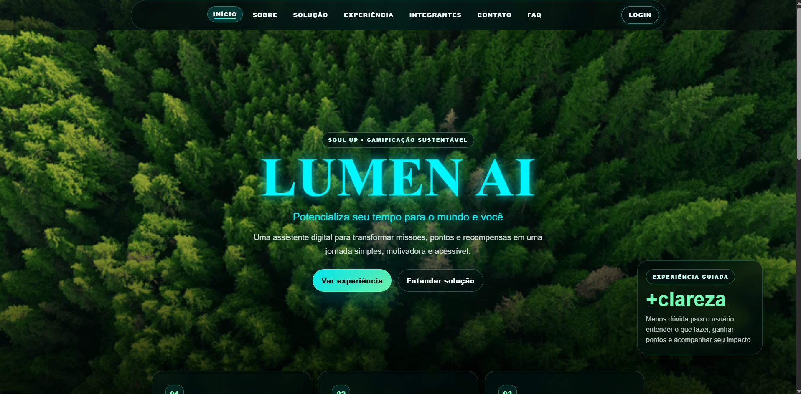

# Lumen AI - SoulUp Challenge

Projeto desenvolvido para o **Challenge 2026 da FIAP**, na disciplina de **Front-End Design Engineering**, com base no desafio da plataforma **SoulUp**.

A proposta do projeto é criar uma experiência digital com um avatar inteligente chamado **Lumën**, capaz de orientar o usuário em missões sustentáveis, explicar próximos passos, apresentar pontos, níveis e tornar a jornada mais clara, interativa e motivadora.

---

## Link do repositório

https://github.com/DioohReis/soul-up-challenge

---

## Desafio escolhido

O grupo escolheu o **Desafio 3 - Avatar Inteligente e Interativo**.

A **Lumen AI** foi pensada como uma assistente visual e interativa para ajudar o usuário a entender a experiência dentro da SoulUp. A ideia principal é transformar ações sustentáveis em uma jornada gamificada, com quests, pontos, níveis e feedback visual.

---

## Objetivo do projeto

Criar uma interface Front-End capaz de:

- apresentar a proposta da solução de forma clara;
- simular uma experiência de usuário com um avatar interativo;
- criar missões sustentáveis relacionadas a problemas ecológicos reais;
- utilizar HTML, CSS e JavaScript de forma separada e organizada;
- aplicar responsividade para desktop, tablet e mobile;
- demonstrar interações com JavaScript sem uso de banco de dados;
- preservar histórico de versionamento com Git e GitHub.

---

## Páginas do projeto

| Página | Função |
|---|---|
| `index.html` | Página inicial com apresentação visual da Lumen AI. |
| `pages/sobre.html` | Explica o contexto, problema, solução, tecnologias e roadmap. |
| `pages/solucao.html` | Demonstra a solução proposta de forma objetiva. |
| `pages/experiencia.html` | Protótipo interativo com Lumën, quests, pontos e níveis. |
| `pages/integrantes.html` | Apresenta a equipe com foto, RM, turma, GitHub e LinkedIn. |
| `pages/contato.html` | Formulário com validação via JavaScript. |
| `pages/faq.html` | Perguntas frequentes sobre o projeto. |
| `pages/login.html` | Login demonstrativo com validação em JavaScript e `localStorage`. |

---

## Tecnologias utilizadas

### HTML5

O HTML foi utilizado para estruturar as páginas do projeto com tags semânticas, facilitando leitura, organização e manutenção.

Principais tags utilizadas:

```html
<header></header>
<nav></nav>
<main></main>
<section></section>
<article></article>
<footer></footer>
<form></form>
<button></button>
```

Exemplo de estrutura aplicada no menu:

```html
<header>
    <button class="menu-toggle" type="button" aria-label="Abrir menu">
        <span></span>
        <span></span>
        <span></span>
    </button>

    <nav class="main-menu" id="menu-principal">
        <a href="index.html">INÍCIO</a>
        <a href="pages/sobre.html">SOBRE</a>
        <a href="pages/solucao.html">SOLUÇÃO</a>
        <a href="pages/experiencia.html">EXPERIÊNCIA</a>
    </nav>
</header>
```

A separação das páginas em arquivos próprios foi importante para manter o projeto organizado e próximo de uma estrutura real de desenvolvimento Front-End.

---

### CSS3

O CSS foi responsável pela identidade visual do projeto: fundo de floresta, cores neon, cards, responsividade, menu, animações e construção visual do personagem Lumën.

Recursos usados:

- variáveis CSS com `:root`;
- flexbox;
- grid layout;
- media queries;
- animações com `@keyframes`;
- efeitos de hover e focus;
- glassmorphism;
- parallax visual;
- responsividade mobile.

Exemplo de variáveis globais:

```css
:root {
    --bg-dark: #00140f;
    --primary: #00f7ff;
    --green: #72ffb6;
    --text: #f2fffc;
    --border: rgba(111, 255, 240, 0.36);
}
```

Essas variáveis ajudaram a manter consistência visual em todo o projeto.

---

### JavaScript

O JavaScript foi utilizado para tornar o projeto interativo. A arquitetura foi mantida simples, com arquivos separados por responsabilidade.

Arquivos principais:

| Arquivo | Função |
|---|---|
| `menu.js` | Controla o menu hambúrguer no mobile. |
| `effects.js` | Controla efeitos visuais e parallax. |
| `lumen.js` | Animações e comportamentos da área Lumën. |
| `integrantes.js` | Interação com cards/carrossel de integrantes. |
| `contato.js` | Validação do formulário de contato. |
| `login.js` | Login demonstrativo e modal de retorno. |
| `prototipo.js` | Experiência interativa, quests, pontos, níveis e `localStorage`. |

Exemplo de abertura do menu mobile:

```js
const menuButton = document.querySelector('.menu-toggle');
const menu = document.querySelector('.main-menu');

menuButton.addEventListener('click', () => {
    menu.classList.toggle('is-open');
    menuButton.classList.toggle('is-active');
});
```

---

## Conceitos importantes aplicados

### 1. Parallax

O parallax é um efeito visual em que o fundo parece se mover em velocidade diferente do conteúdo principal. Isso cria profundidade e deixa a página mais dinâmica.

No projeto, ele foi aplicado no banner principal, utilizando o fundo de floresta e pequenas mudanças de posição durante o scroll.

Exemplo simplificado:

```js
window.addEventListener('scroll', () => {
    const deslocamento = window.scrollY * 0.25;
    document.documentElement.style.setProperty('--bg-parallax', `${deslocamento}px`);
});
```

No CSS, esse valor é usado para alterar a posição do fundo:

```css
.banner::before {
    background-position: center calc(50% + var(--bg-parallax, 0px));
}
```

Esse efeito ajudou a deixar a página inicial mais moderna e imersiva.

---

### 2. Carrossel e interação dos integrantes

A página de integrantes recebeu uma lógica interativa para destacar membros da equipe. A ideia é permitir que o usuário clique em um integrante e visualize informações específicas.

Conceito utilizado:

- cards de integrantes;
- evento de clique;
- alteração dinâmica de conteúdo;
- exibição de GitHub e LinkedIn com ícones.

Exemplo de lógica:

```js
cardsIntegrantes.forEach((card) => {
    card.addEventListener('click', () => {
        const nome = card.dataset.nome;
        const rm = card.dataset.rm;

        detalheNome.textContent = nome;
        detalheRm.textContent = rm;
    });
});
```

Essa interação melhora a navegação e evita que a página fique apenas estática.

---

### 3. Lumën feito com CSS

O avatar **Lumën** foi criado usando HTML e CSS, com elementos visuais separados para formar cabeça, corpo, aura, chama/cabelo e balão de fala.

Esse recurso foi importante porque demonstra domínio de CSS além do uso básico de cores e fontes.

Exemplo simplificado da estrutura:

```html
<div class="lumen-mascot">
    <div class="lumen-aura"></div>
    <div class="lumen-fire-hair"></div>
    <div class="lumen-head"></div>
    <div class="lumen-body"></div>
</div>
```

Exemplo de animação:

```css
.lumen-mascot {
    animation: floatLumen 4s ease-in-out infinite;
}

@keyframes floatLumen {
    0%, 100% {
        transform: translateY(0);
    }
    50% {
        transform: translateY(-12px);
    }
}
```

O Lumën foi usado como elemento central da experiência, funcionando como guia visual do usuário.

---

### 4. LocalStorage

O `localStorage` foi usado para salvar informações simples no navegador, sem necessidade de banco de dados.

No projeto, ele salva:

- usuário logado;
- nome exibido no balão do Lumën;
- pontuação acumulada;
- quests concluídas.

Exemplo usado no login:

```js
const dadosUsuario = {
    nome: usuario.nome,
    email: usuario.email
};

localStorage.setItem('usuarioSoulUp', JSON.stringify(dadosUsuario));
```

Para buscar os dados novamente:

```js
const dadosSalvos = localStorage.getItem('usuarioSoulUp');
const usuario = JSON.parse(dadosSalvos);
```

Esse recurso foi importante para simular persistência de dados em um projeto Front-End de primeiro semestre.

---

### 5. Modal

O modal foi utilizado para mostrar mensagens de retorno ao usuário, principalmente no login e na conclusão de quests.

Ele informa, por exemplo:

- login realizado com sucesso;
- email não cadastrado;
- senha incorreta;
- quest concluída;
- pontos recebidos.

Exemplo simplificado:

```js
function abrirModal(titulo, mensagem) {
    modalTitulo.textContent = titulo;
    modalMensagem.textContent = mensagem;
    modal.classList.add('is-open');
}
```

O modal melhora a experiência porque o usuário recebe feedback imediato da ação que acabou de realizar.

---

### 6. Quests sustentáveis

A página `experiencia.html` foi evoluída para oferecer quests relacionadas a problemas ecológicos reais.

Temas trabalhados:

- mudanças climáticas;
- resíduos;
- desperdício de água;
- biodiversidade;
- poluição urbana.

Cada tema possui quests com dificuldade e pontuação:

| Dificuldade | Exemplo | Pontos |
|---|---|---:|
| Fácil | Desligar luzes e reduzir consumo por 2 horas | 40 pts |
| Médio | Fazer um trajeto de baixo carbono | 80 pts |
| Difícil | Passar um dia com consumo consciente | 140 pts |

Exemplo de objeto JavaScript usado para uma quest:

```js
const quest = {
    titulo: 'Trajeto de baixo carbono',
    dificuldade: 'Médio',
    pontos: 80,
    descricao: 'Faça um trajeto curto caminhando, de bicicleta, transporte público ou carona compartilhada.'
};
```

Essa lógica conecta sustentabilidade, gamificação e experiência do usuário.

---

## Etapas visuais do desenvolvimento

### Primeira versão da interface

A primeira versão tinha uma navegação mais simples e foco na apresentação visual do nome Lumen AI sobre o fundo de floresta.



---

### Evolução da UX/UI

Depois, a interface recebeu melhorias de hierarquia visual, botões de ação, cards explicativos e uma barra de menu mais profissional.



---

### Primeira experiência interativa

A página de experiência começou com perfis de usuário e sugestões da Lumën, mostrando impacto estimado e recomendações personalizadas.



---

### Evolução para quests sustentáveis

A experiência foi transformada em um sistema de quests, com temas ecológicos, dificuldades, pontos e feedback ao usuário.



---

### Versão final da home

A versão final manteve a identidade visual com floresta, neon, menu centralizado, login separado e chamadas para experiência e solução.



---

## Histórico de atualizações do projeto

### Versão 1 - Estrutura inicial

- Criação das páginas principais.
- Implementação do fundo animado.
- Criação da identidade visual inicial com Lumen AI.
- Menu básico.

### Versão 2 - Organização visual

- Ajuste do menu.
- Melhorias nas páginas Sobre, FAQ e Contato.
- Adição de responsividade inicial.
- Correção de elementos visuais quebrados.

### Versão 3 - UX/UI profissional

- Melhoria da home.
- Inclusão de CTAs.
- Criação de cards explicativos.
- Refinamento visual com glassmorphism.
- Ajustes de contraste e espaçamento.

### Versão 4 - Integração do Lumën

- Criação do avatar Lumën em CSS.
- Criação da página Experiência.
- Sugestões interativas por perfil de usuário.
- Responsividade da experiência no mobile.

### Versão 5 - Login e personalização

- Criação da página de login.
- Lista simulada de usuários.
- Validação com JavaScript.
- Modal de sucesso e erro.
- Salvamento do nome do usuário no `localStorage`.
- Exibição do nome no balão da Lumën.

### Versão 6 - Quests sustentáveis

- Transformação da experiência em sistema de quests.
- Criação de temas ecológicos.
- Pontuação por dificuldade.
- Sistema de níveis.
- Armazenamento de progresso no navegador.

### Versão 7 - Otimização para entrega

- Remoção de mídias não utilizadas.
- Compressão de imagens.
- Otimização do `fundo.gif`.
- Manutenção da pasta `.git`.
- Preservação do histórico em `GIT_HISTORICO.txt`.
- Redução do ZIP para ficar abaixo de 50 MB.

---

## Conteúdos de estudo utilizados

Durante o desenvolvimento, foram usados materiais de apoio relacionados a HTML, CSS, JavaScript, responsividade, manipulação do DOM e interações Front-End.

Links de referência enviados pelo grupo:

- https://www.youtube.com/watch?v=yqaLSlPOUxM&list=PLcF-2M9iPSkGwgfWbn245v-hubrKzV3vC&index=29
- https://www.youtube.com/watch?v=DnODupiIAiE&list=PLcF-2M9iPSkGwgfWbn245v-hubrKzV3vC&index=31
- https://www.youtube.com/watch?v=uTPO6fKtBvM&list=PLcF-2M9iPSkGwgfWbn245v-hubrKzV3vC&index=26
- https://www.youtube.com/watch?v=pFtxR-O78sY&list=PLcF-2M9iPSkGwgfWbn245v-hubrKzV3vC&index=30

Esses conteúdos ajudaram principalmente em:

- estrutura HTML;
- estilização com CSS;
- responsividade;
- manipulação de elementos com JavaScript;
- criação de eventos de clique;
- uso de formulários;
- organização de arquivos do projeto.

E um agradecimento especial ao Professor Alexandre Carlos de Jesus, pelos feedback e materiais de apoio. A quem devo muito!!!
---

## Critérios de Front-End atendidos

- Estrutura semântica com HTML5.
- Separação entre HTML, CSS e JavaScript.
- Páginas obrigatórias implementadas.
- Duas páginas dedicadas à solução.
- Navegação por menu principal.
- Layout responsivo para desktop, tablet e mobile.
- Interatividade com JavaScript.
- Formulário com validação.
- Página de integrantes com informações completas da equipe.
- Organização de pastas e arquivos.
- Uso de Git e GitHub.
- README documentando o projeto.
- Protótipo funcional com interação real.
- Otimização do ZIP para entrega.

---

## Estrutura de pastas

```text
soul-up-challegen/
├── index.html
├── README.md
├── GIT_HISTORICO.txt
├── css/
│   ├── style.css
│   ├── integrantes.css
│   └── lumen.css
├── js/
│   ├── menu.js
│   ├── effects.js
│   ├── lumen.js
│   ├── integrantes.js
│   ├── contato.js
│   ├── login.js
│   └── prototipo.js
├── image/
├── docs/
│   └── imagens/
└── pages/
    ├── sobre.html
    ├── solucao.html
    ├── experiencia.html
    ├── integrantes.html
    ├── contato.html
    ├── login.html
    └── faq.html
```

---

## Integrantes

| Nome | RM | Turma | GitHub | LinkedIn |
|---|---:|---|---|---|
| Diogo Guilherme | 573301 | 1TDSPF | https://github.com/DioohReis | https://www.linkedin.com/in/diogo-guilherme-de-assis-reis-95b11624b/ |
| Gabriel Ricardo | 573302 | 1TDSPF | https://github.com/gabriel-ricardo-ADS | https://www.linkedin.com/in/gabriel-ricardo-lima/ |
| Matheus Rodrigues | 570469 | 1TDSPF | https://github.com/MatheusRodriguesSerrao | https://www.linkedin.com/in/matheus-rodrigues-06060a3a6/ |
| Luiz Henrique | 572727 | 1TDSPF | https://github.com/LuizHenriqueAAlbarello | https://www.linkedin.com/in/luiz-henrique-alves-albarello-82297b410/ |
| Gabriel Razo | 572244 | 1TDSPF | https://github.com/gabrielrazod9j-ops | https://www.linkedin.com/in/gabriel-razo-dantas-34724b301/ |

---

## Login demonstrativo

O projeto possui uma página `pages/login.html` com autenticação simulada em JavaScript.

Exemplo de usuário para teste:

```text
Email: diogo@soulup.com
Senha: diogo123
```

Após o login, o nome do usuário é salvo no `localStorage` e exibido no balão da Lumën na página `experiencia.html`.

---

## Como executar

1. Baixe ou clone o repositório.
2. Abra a pasta no VS Code.
3. Abra o arquivo `index.html` no navegador.
4. Opcionalmente, use a extensão **Live Server** para navegar entre as páginas.

---

## Como testar as principais interações

1. Abra `index.html` e teste o menu.
2. Acesse `pages/login.html` e faça login com um usuário demonstrativo.
3. Acesse `pages/experiencia.html`.
4. Verifique se o nome aparece no balão da Lumën.
5. Escolha um problema ecológico.
6. Conclua uma quest.
7. Veja os pontos e o nível sendo atualizados.
8. Atualize a página e confirme que o progresso continua salvo.
9. Teste o formulário em `pages/contato.html`.
10. Teste o menu no modo responsivo do navegador.

---

## Otimização para entrega

O projeto foi revisado para reduzir o tamanho do arquivo `.zip` sem comprometer a interface.

Ações realizadas:

- remoção de imagens não utilizadas;
- compressão de imagens ativas;
- otimização do `fundo.gif` mantendo a animação;
- limpeza de arquivos duplicados;
- manutenção da pasta `.git`;
- preservação do histórico em `GIT_HISTORICO.txt`;
- foco na branch `main` para entrega final.

---

## Status

Projeto finalizado para entrega acadêmica do Challenge SoulUp nas sprints 1 e 2 - FIAP 2026.
