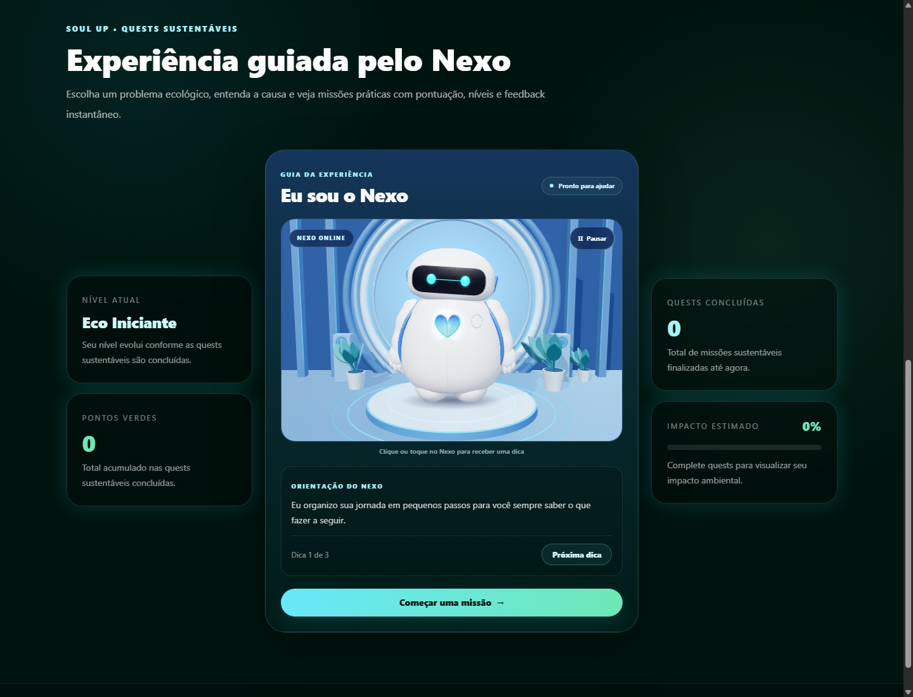
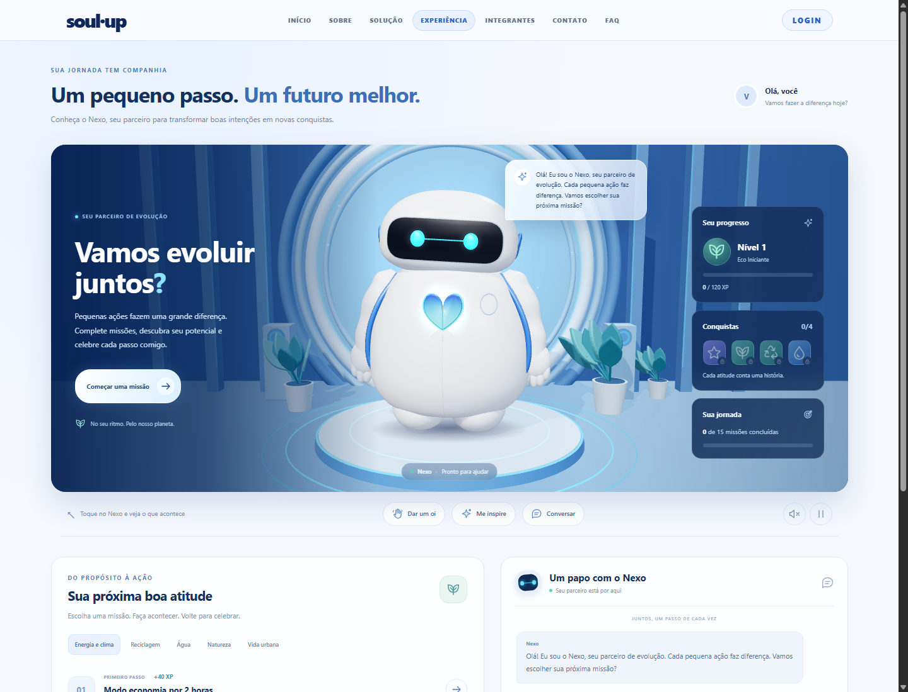
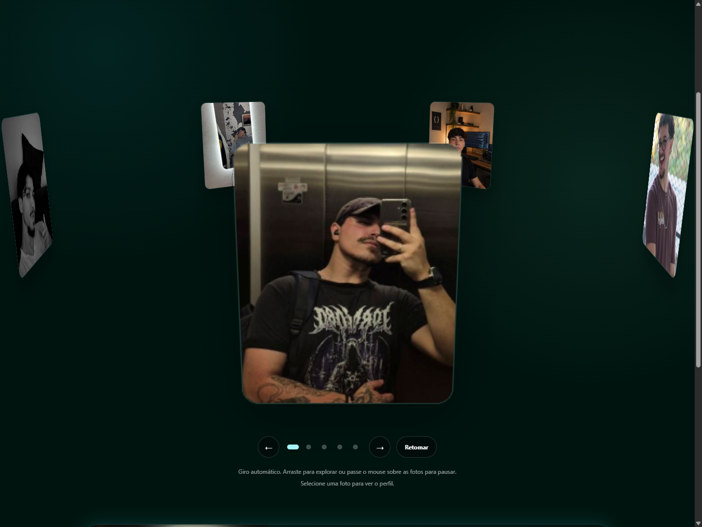
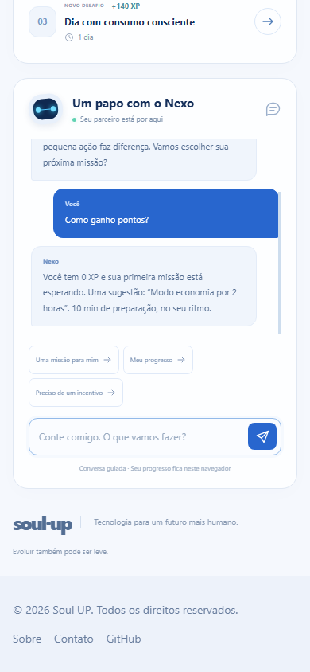
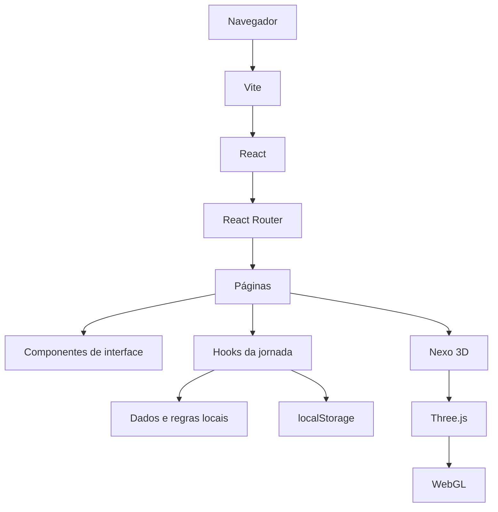
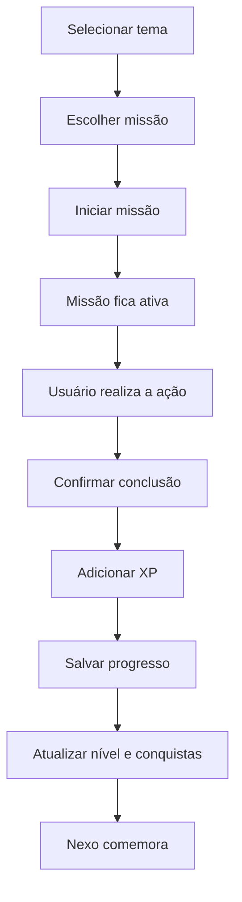
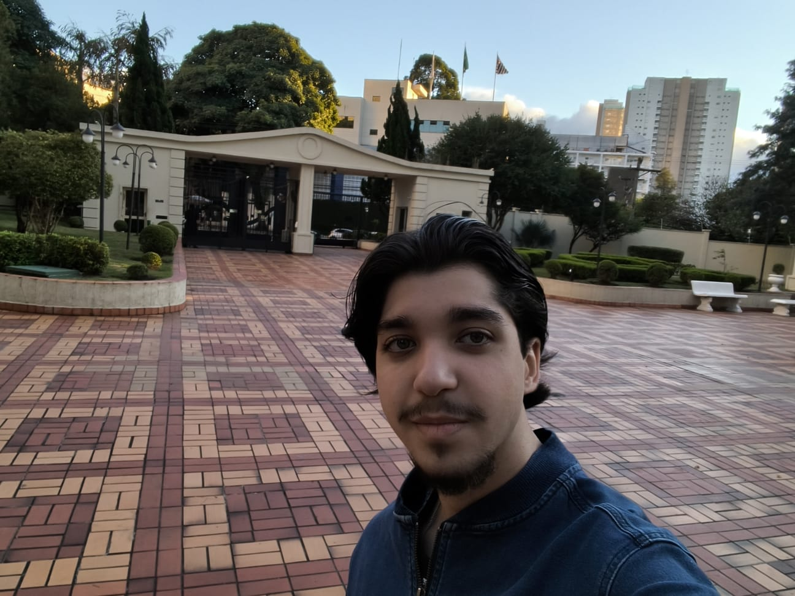

https://www.youtube.com/watch?v=oXtvHNetg&list=PLcF-2M9iPSkGeEEfcYFv0e-eHLnwvsjhhj

# Lumen AI · Soul UP — Challenge 2026

> Aplicação Front-End desenvolvida pela equipe **1TDSPF** para o desafio **Avatar Inteligente e Interativo** da Soul UP, na disciplina **Front-End Design Engineering — Sprint 3**.

O **Lumen AI** é uma experiência web gamificada de sustentabilidade. O projeto transforma ações ambientais em uma jornada acompanhada pelo **Nexo**, um avatar 3D interativo que apresenta missões, reage ao usuário, acompanha XP e conquistas e conduz uma conversa local baseada em regras.

A aplicação foi construída como uma **SPA (Single Page Application)** com **React 18, TypeScript, Vite, Tailwind CSS, React Router DOM, React Hook Form e Three.js**. Nesta Sprint, todo o fluxo funciona localmente no navegador: não há API externa, backend, banco de dados remoto ou IA generativa em produção.

---

## Sumário

- [1. Visão geral](#1-visão-geral)
- [2. Contexto acadêmico e objetivo](#2-contexto-acadêmico-e-objetivo)
- [3. Escopo da Sprint](#3-escopo-da-sprint)
- [4. Demonstração visual](#4-demonstração-visual)
- [5. Tecnologias utilizadas](#5-tecnologias-utilizadas)
- [6. Arquitetura da aplicação](#6-arquitetura-da-aplicação)
- [7. Estrutura de diretórios](#7-estrutura-de-diretórios)
- [8. Rotas](#8-rotas)
- [9. Nexo 3D — modelagem e renderização](#9-nexo-3d--modelagem-e-renderização)
- [10. Estados e animações do Nexo](#10-estados-e-animações-do-nexo)
- [11. Jornada, missões e gamificação](#11-jornada-missões-e-gamificação)
- [12. Conversa guiada e voz](#12-conversa-guiada-e-voz)
- [13. Persistência local](#13-persistência-local)
- [14. Carrossel 3D da equipe](#14-carrossel-3d-da-equipe)
- [15. Formulários e login demonstrativo](#15-formulários-e-login-demonstrativo)
- [16. Responsividade](#16-responsividade)
- [17. Acessibilidade](#17-acessibilidade)
- [18. Performance e ciclo de vida](#18-performance-e-ciclo-de-vida)
- [19. Como executar](#19-como-executar)
- [20. Fluxo de funcionamento](#20-fluxo-de-funcionamento)
- [21. Decisões técnicas](#21-decisões-técnicas)
- [22. Limitações atuais](#22-limitações-atuais)
- [23. Evoluções futuras](#23-evoluções-futuras)
- [24. Guia rápido para avaliação](#24-guia-rápido-para-avaliação)
- [25. Equipe](#25-equipe)
- [26. Conclusão](#26-conclusão)

---

# 1. Visão geral

A proposta do projeto é transformar sustentabilidade em uma experiência digital mais próxima, visual e motivadora.

Em vez de apresentar apenas informações sobre problemas ambientais, o sistema oferece uma **jornada prática**:

1. o usuário escolhe um tema ambiental;
2. recebe missões relacionadas ao tema;
3. inicia uma missão;
4. realiza a ação no mundo real;
5. confirma sua conclusão;
6. recebe XP;
7. evolui de nível;
8. desbloqueia conquistas;
9. acompanha o Nexo reagindo ao progresso.

O projeto combina três camadas principais:

```text
Interface React
      ↓
Estado da jornada
      ↓
Experiência 3D do Nexo
```

O Nexo não é apenas uma imagem posicionada na tela. Ele é modelado por código e renderizado em tempo real com **Three.js/WebGL**, possuindo estados, animações, iluminação e interação.

---

# 2. Contexto acadêmico e objetivo

Este projeto foi desenvolvido para o Challenge 2026 da Soul UP dentro da disciplina de Front-End Design Engineering.

O principal objetivo acadêmico é aplicar de forma integrada conceitos de desenvolvimento Front-End moderno, entre eles:

- componentização;
- reutilização de interface;
- tipagem estática;
- navegação SPA;
- rotas dinâmicas;
- gerenciamento de estado;
- formulários tipados;
- validação;
- armazenamento local;
- responsividade;
- acessibilidade;
- animações;
- interação com ponteiro e teclado;
- renderização 3D em tempo real;
- separação de responsabilidades;
- preparação arquitetural para integrações futuras.

Além da implementação funcional, o projeto busca demonstrar uma preocupação com **UX/UI**, clareza de navegação, feedback ao usuário e consistência visual.

---

# 3. Escopo da Sprint

## Implementado

A versão atual contém:

- SPA com React Router;
- páginas institucionais;
- rota dinâmica de integrante;
- avatar Nexo 3D;
- interação com ponteiro, clique e teclado;
- estados emocionais do avatar;
- animações procedurais;
- ambiente 3D;
- conversa guiada por regras;
- síntese de voz opcional;
- 15 missões sustentáveis;
- 5 temas ambientais;
- XP;
- níveis;
- conquistas;
- missão ativa;
- persistência com `localStorage`;
- carrossel 3D da equipe;
- formulários com React Hook Form;
- login demonstrativo local;
- FAQ interativo;
- responsividade;
- suporte a `prefers-reduced-motion`;
- fallback em caso de falha WebGL.

## Não implementado nesta Sprint

Ainda não fazem parte da implementação atual:

- backend;
- banco de dados remoto;
- autenticação real;
- IA generativa conectada a API;
- sincronização de dados em nuvem;
- comprovação automática de missões;
- resgate real de recompensas;
- integração de produção com API Java.

Essa separação é importante porque evita apresentar como concluído algo que está apenas planejado para evolução futura.

---

# 4. Demonstração visual

## Página inicial



## Experiência com o Nexo



## Carrossel da equipe



## Experiência em dispositivo móvel



As imagens acima estão armazenadas localmente em `docs/imagens/`.

---

# 5. Tecnologias utilizadas

As versões abaixo correspondem ao `package.json` do projeto.

| Tecnologia | Versão | Responsabilidade |
| --- | ---: | --- |
| React | 18.3.1 | Componentes, estado, efeitos e composição da interface |
| React DOM | 18.3.1 | Renderização da aplicação React |
| TypeScript | 5.7.2 | Tipagem estática e segurança durante o desenvolvimento |
| Vite | 7.3.6 | Servidor de desenvolvimento e build |
| Tailwind CSS | 3.4.17 | Estilização, design system e responsividade |
| React Router DOM | 7.18.3 | Navegação e rotas da SPA |
| React Hook Form | 7.54.2 | Gerenciamento e validação de formulários |
| Three.js | 0.180.0 | Modelagem, animação e renderização 3D |
| PostCSS | 8.5.28 | Processamento do CSS |
| Autoprefixer | 10.4.20 | Compatibilidade de propriedades CSS |
| Git / GitHub | — | Versionamento, histórico e colaboração |

## Por que cada tecnologia foi escolhida?

### React

Foi utilizado para dividir a aplicação em componentes reutilizáveis e manter a interface sincronizada com os estados do usuário.

### TypeScript

Foi adotado para deixar props, formulários, dados de missões, estados do Nexo e estruturas compartilhadas explicitamente tipados.

### Vite

Fornece inicialização rápida, Hot Module Replacement durante o desenvolvimento e build otimizado para produção.

### Tailwind CSS

Centraliza a construção visual diretamente nos componentes e permite trabalhar com breakpoints, estados, `focus-visible`, `motion-reduce` e variações responsivas sem depender de uma biblioteca pronta de UI.

### React Router DOM

Permite trocar de páginas sem recarregar todo o documento, característica central de uma SPA.

### React Hook Form

Reduz código repetitivo nos formulários e organiza registro de campos, erros, validação e submissão.

### Three.js

É o motor gráfico responsável pelo Nexo. A biblioteca abstrai a comunicação direta com WebGL e permite trabalhar com câmera, iluminação, geometria, materiais, sombras e animações.

---

# 6. Arquitetura da aplicação

A aplicação segue uma separação por responsabilidade.



Na prática:

```text
React
├── interface
├── páginas
├── formulários
├── navegação
├── estados
└── composição
      │
      └── Experiência
            │
            ├── useNexoJourney
            │
            └── Nexo3D
                   │
                   ├── NexoModel
                   ├── NexoAnimations
                   ├── NexoEnvironment
                   └── Three.js / WebGL
```

Essa separação evita utilizar WebGL para elementos que funcionam melhor com HTML semântico.

Textos, botões, formulários, cards e menus continuam sendo React/HTML. Somente a experiência tridimensional é renderizada com Three.js.

---

# 7. Estrutura de diretórios

```text
soul-up-challenge/
├── docs/
│   └── imagens/                      Capturas e referências visuais
│
├── public/
│   └── image/                        Fotos, logo e assets estáticos
│
├── src/
│   ├── components/
│   │   ├── experience/               Componentes da página Experiência
│   │   ├── gamification/             HUD e elementos de gamificação
│   │   ├── lumen/                    Componentes de protótipos anteriores
│   │   ├── nexo/                     Assistência e conversa do Nexo
│   │   ├── nexo3d/                   Modelo, animações e ambiente 3D
│   │   ├── Footer.tsx
│   │   ├── GlassCard.tsx
│   │   ├── Header.tsx
│   │   ├── Layout.tsx
│   │   ├── Modal.tsx
│   │   ├── PageHero.tsx
│   │   ├── ScrollToTop.tsx
│   │   ├── SocialIcon.tsx
│   │   └── TeamCarousel.tsx
│   │
│   ├── data/
│   │   ├── experience.ts
│   │   ├── lumen.ts
│   │   ├── nexo.ts
│   │   ├── nexoJourney.ts
│   │   ├── quests.ts
│   │   └── team.ts
│   │
│   ├── hooks/
│   │   ├── useNexoDialogue.ts
│   │   ├── useNexoInteraction.ts
│   │   ├── useNexoJourney.ts
│   │   └── useNexoSpeech.ts
│   │
│   ├── pages/
│   │   ├── Contato.tsx
│   │   ├── Experiencia.tsx
│   │   ├── Faq.tsx
│   │   ├── Home.tsx
│   │   ├── IntegranteDetalhe.tsx
│   │   ├── Integrantes.tsx
│   │   ├── Login.tsx
│   │   ├── NotFound.tsx
│   │   ├── Sobre.tsx
│   │   └── Solucao.tsx
│   │
│   ├── types/
│   │   ├── index.ts
│   │   ├── journey.ts
│   │   └── nexo.ts
│   │
│   ├── utils/
│   │   ├── journeyStorage.ts
│   │   └── storage.ts
│   │
│   ├── App.tsx
│   ├── index.css
│   └── main.tsx
│
├── GIT_HISTORICO.txt
├── index.html
├── package.json
├── package-lock.json
├── postcss.config.js
├── tailwind.config.ts
├── tsconfig.app.json
├── tsconfig.json
├── tsconfig.node.json
└── vite.config.ts
```

---

# 8. Rotas

As rotas são definidas em `src/App.tsx`.

| Rota | Página | Objetivo |
| --- | --- | --- |
| `/` | `Home` | Apresentação da solução e resumo do progresso |
| `/sobre` | `Sobre` | Contextualização do projeto |
| `/solucao` | `Solucao` | Explicação da proposta |
| `/experiencia` | `Experiencia` | Jornada gamificada e Nexo 3D |
| `/integrantes` | `Integrantes` | Carrossel e dados da equipe |
| `/integrantes/:rm` | `IntegranteDetalhe` | Perfil dinâmico de integrante |
| `/contato` | `Contato` | Formulário demonstrativo |
| `/faq` | `Faq` | Perguntas frequentes |
| `/login` | `Login` | Login local demonstrativo |
| `*` | `NotFound` | Tratamento de rota inexistente |

## Rota dinâmica

A rota:

```text
/integrantes/:rm
```

utiliza `useParams()` para recuperar o RM informado na URL.

Isso permite reutilizar a mesma página para todos os integrantes:

```text
/integrantes/573301
/integrantes/572279
```

A interface procura o integrante correspondente no conjunto de dados da equipe e apresenta seu perfil.

---

# 9. Nexo 3D — modelagem e renderização

O Nexo foi implementado em:

```text
src/components/nexo3d/
├── Nexo3D.tsx
├── NexoAnimations.ts
├── NexoEnvironment.ts
├── NexoModel.ts
└── NexoStage.tsx
```

## 9.1 `NexoModel.ts`

Responsável pela modelagem procedural do personagem.

O modelo é construído diretamente com geometrias do Three.js, sem depender de um arquivo `.glb` ou `.gltf`.

Entre os elementos construídos estão:

- corpo;
- cabeça;
- visor;
- olhos;
- brilho dos olhos;
- olhos felizes;
- braços;
- antebraços;
- mãos;
- pés;
- núcleo;
- halo do núcleo;
- luz do núcleo;
- detalhes e sensores.

### Materiais

O projeto utiliza principalmente:

- `MeshPhysicalMaterial`;
- `MeshStandardMaterial`;
- `MeshBasicMaterial`.

O corpo utiliza material perolado com propriedades como:

```text
roughness
clearcoat
clearcoatRoughness
sheen
```

Os olhos utilizam emissão de luz com:

```text
emissive
emissiveIntensity
```

Isso ajuda a criar o visual tecnológico e luminoso do personagem.

## 9.2 `NexoEnvironment.ts`

Responsável pelo ambiente em que o Nexo é apresentado.

O cenário contém elementos como:

- piso;
- estruturas arquitetônicas;
- portal luminoso;
- pedestal;
- anéis;
- sombra de contato;
- plantas;
- partículas/motes;
- materiais luminosos.

Parte das texturas é gerada em tempo de execução usando `CanvasTexture`.

## 9.3 `Nexo3D.tsx`

É a camada que integra React ao Three.js.

Principais responsabilidades:

- criar `Scene`;
- criar `PerspectiveCamera`;
- criar `WebGLRenderer`;
- configurar sombras;
- configurar espaço de cor;
- configurar tone mapping;
- inserir o modelo;
- inserir o ambiente;
- inserir luzes;
- executar o loop de animação;
- acompanhar o ponteiro;
- observar redimensionamento;
- pausar fora da viewport;
- tratar perda do contexto WebGL;
- liberar recursos ao desmontar o componente.

### Configuração gráfica

A renderização utiliza:

```text
WebGLRenderer
antialias: true
alpha: true
PCFSoftShadowMap
SRGBColorSpace
ACESFilmicToneMapping
```

O pixel ratio é limitado para equilibrar nitidez e desempenho.

Em telas menores:

```text
máximo ≈ 1.5
```

Em telas maiores:

```text
máximo ≈ 1.8
```

## 9.4 Iluminação

A cena combina diferentes luzes, incluindo:

- `DirectionalLight`;
- `PointLight`;
- iluminação de preenchimento;
- iluminação de recorte;
- iluminação do portal;
- luz interna do núcleo.

Isso evita uma aparência plana e ajuda a destacar volume, contorno e profundidade.

---

# 10. Estados e animações do Nexo

Os estados compartilhados do Nexo representam a linguagem corporal do personagem.

Estados disponíveis:

```text
idle
looking
listening
thinking
talking
happy
celebrating
sleeping
```

## Significado

| Estado | Comportamento |
| --- | --- |
| `idle` | comportamento padrão |
| `looking` | acompanha a presença do usuário |
| `listening` | demonstra atenção |
| `thinking` | simula processamento |
| `talking` | reage durante a resposta |
| `happy` | resposta positiva |
| `celebrating` | comemoração |
| `sleeping` | estado de descanso |

## Animação procedural

`NexoAnimations.ts` não reproduz vídeos nem frames pré-renderizados.

Em cada frame, o arquivo calcula valores como:

- posição;
- rotação;
- inclinação;
- movimento dos braços;
- movimento dos antebraços;
- movimento da cabeça;
- acompanhamento dos olhos;
- pulso do núcleo;
- piscadas;
- expressão feliz;
- balanço de comemoração.

O movimento do ponteiro influencia o olhar:

```text
ponteiro
   ↓
posição normalizada
   ↓
força de acompanhamento
   ↓
rotação da cabeça + deslocamento dos olhos
```

As transições utilizam suavização baseada no `delta` entre frames, evitando mudanças bruscas.

## Piscadas e expressões

O Nexo possui:

- piscadas periódicas;
- possibilidade de piscar um olho no estado `looking`;
- olhos curvos e sorriso visual quando está feliz;
- variações de postura de acordo com o estado.

---

# 11. Jornada, missões e gamificação

A jornada principal é coordenada pelo hook:

```text
src/hooks/useNexoJourney.ts
```

Ele concentra:

- pontos;
- missão ativa;
- missões concluídas;
- tema selecionado;
- mensagens;
- estado do avatar;
- persistência;
- conquistas;
- nível;
- recomendação de próxima missão.

## 11.1 Temas ambientais

Há **5 temas**:

1. Mudanças climáticas;
2. Resíduos e descarte incorreto;
3. Desperdício de água;
4. Perda de biodiversidade;
5. Poluição urbana.

Cada tema possui 3 missões:

```text
fácil
média
difícil
```

Total:

```text
5 temas × 3 missões = 15 missões
```

## 11.2 Pontuação

Cada missão possui uma quantidade própria de XP.

A conclusão adiciona os pontos da missão ao progresso.

Uma missão já concluída não deve conceder XP novamente.

## 11.3 Níveis

A progressão definida no projeto é:

| XP | Nível |
| ---: | --- |
| 0–119 | Eco Iniciante |
| 120–299 | Eco Ativo |
| 300–499 | Eco Líder |
| 500+ | Guardião Verde |

O percentual exibido no HUD é calculado com base no intervalo entre o nível atual e o próximo nível.

## 11.4 Conquistas

As conquistas atuais são:

| Conquista | Regra |
| --- | --- |
| Primeiro passo | concluir a primeira missão |
| Em evolução | concluir 5 missões |
| Novo ciclo | concluir uma missão de resíduos |
| Cada gota conta | concluir uma missão de água |

## 11.5 Fluxo de uma missão



---

# 12. Conversa guiada e voz

A conversa do Nexo nesta Sprint é **local e baseada em regras**.

Ela não envia a mensagem para ChatGPT, OpenAI ou qualquer outro serviço de IA.

A função principal de resposta está em:

```text
src/data/nexoJourney.ts
```

## Como funciona

A mensagem do usuário é:

1. normalizada;
2. convertida para minúsculas;
3. analisada por palavras-chave e expressões regulares;
4. associada a uma categoria;
5. respondida com base no contexto atual.

Categorias tratadas incluem:

- desânimo/motivação;
- conclusão de missão;
- progresso;
- pontos;
- XP;
- níveis;
- conquistas;
- recompensas;
- sugestão de missão;
- saudação;
- agradecimento;
- água;
- resíduos;
- clima;
- biodiversidade;
- poluição.

Quando a mensagem não corresponde a nenhuma regra, o Nexo informa os assuntos que consegue atender.

## Limite de mensagem

A entrada é limitada a:

```text
280 caracteres
```

## Simulação de processamento

Após o envio:

```text
mensagem
   ↓
thinking
   ↓
pequeno atraso
   ↓
resposta local
   ↓
talking
   ↓
idle
```

O atraso de resposta cria feedback visual e permite que o estado do avatar acompanhe a conversa.

## Síntese de voz

Quando o navegador oferece suporte a:

```text
window.speechSynthesis
```

o usuário pode ativar leitura da resposta.

A aplicação cria:

```text
SpeechSynthesisUtterance
```

com idioma:

```text
pt-BR
```

A voz é um recurso do próprio navegador e não depende de serviço externo.

---

# 13. Persistência local

O progresso é salvo com `localStorage`.

As principais chaves utilizadas são:

```text
usuarioSoulUp
pontosSoulUp
questsConcluidasSoulUp
nexoJourneySoulUp
```

## O que é persistido

- usuário demonstrativo;
- XP;
- IDs das missões concluídas;
- missão ativa;
- snapshot da jornada.

## Validação dos dados

Antes de utilizar os valores recuperados, o código valida:

- formato do usuário;
- formato do e-mail;
- pontos não negativos;
- IDs de missões;
- estrutura JSON.

Isso evita depender cegamente de dados armazenados no navegador.

## Sincronização entre abas

O hook da jornada escuta:

```text
storage
```

do navegador.

Assim, alterações feitas em outra aba podem ser incorporadas ao estado atual.

## Quando o armazenamento não está disponível

A aplicação testa a disponibilidade do `localStorage`.

Caso o navegador bloqueie a persistência, a interface continua funcionando durante a sessão e pode informar que os dados não serão preservados.

---

# 14. Carrossel 3D da equipe

O componente:

```text
src/components/TeamCarousel.tsx
```

implementa um carrossel tridimensional usando transformações CSS.

A rotação utiliza:

```text
perspective(...)
rotateX(...)
rotateY(...)
translateZ(...)
```

Cada foto é distribuída em um ângulo proporcional ao número de integrantes.

## Rotação automática

A constante atual é:

```text
ROTATION_SPEED = 18
```

ou seja, aproximadamente:

```text
18° por segundo
```

Uma volta completa de 360° leva aproximadamente 20 segundos.

## Interações

O usuário pode:

- arrastar com o ponteiro;
- usar os botões anterior/próximo;
- clicar em um integrante;
- utilizar setas esquerda/direita pelo teclado;
- pausar a rotação;
- selecionar indicadores de posição.

A rotação automática é suspensa quando:

- o usuário passa o mouse sobre o carrossel;
- um elemento interno recebe foco;
- o usuário está arrastando;
- a opção de pausa está ativa;
- `prefers-reduced-motion` está ativo;
- o componente está fora da viewport.

---

# 15. Formulários e login demonstrativo

## React Hook Form

Os formulários utilizam:

```text
react-hook-form
```

com tipos TypeScript.

O fluxo é:

```text
campo
  ↓
register()
  ↓
validação
  ↓
errors
  ↓
handleSubmit()
```

## Contato

A página de contato valida os dados e apresenta feedback ao usuário.

Nesta Sprint:

```text
não há envio para servidor
```

O formulário é demonstrativo.

## Login

O login também é demonstrativo.

Ao utilizar uma das contas locais válidas, os dados básicos do usuário são armazenados em:

```text
usuarioSoulUp
```

Depois, a aplicação pode utilizar o primeiro nome na experiência do Nexo.

Não existe:

- token;
- sessão de servidor;
- OAuth;
- senha criptografada no backend;
- autorização por API.

Portanto, essa tela não deve ser tratada como autenticação de produção.

---

# 16. Responsividade

O projeto utiliza uma abordagem mobile-first.

Os breakpoints configurados em `tailwind.config.ts` são:

| Nome | Largura |
| --- | ---: |
| `sm` | 480px |
| `md` | 768px |
| `lg` | 992px |
| `xl` | 1200px |
| `2xl` | 1440px |

A aplicação adapta:

- grids;
- flexbox;
- tipografia;
- espaçamentos;
- altura do canvas;
- posição dos elementos;
- carrossel;
- cards;
- menus;
- conteúdo secundário.

## Canvas 3D

O `ResizeObserver` acompanha as dimensões reais do container.

Quando o tamanho muda, são recalculados:

- largura do renderer;
- altura do renderer;
- aspect ratio;
- projeção da câmera;
- distância da câmera.

Assim, o avatar não depende de resolução fixa.

---

# 17. Acessibilidade

Foram incorporados vários cuidados de acessibilidade.

## Teclado

Elementos interativos possuem suporte a teclado.

Exemplos:

- Nexo pode receber foco;
- Enter e Espaço ativam interação;
- carrossel responde às setas;
- botões possuem foco visível.

## Estados ARIA

O projeto utiliza atributos como:

```text
aria-label
aria-pressed
aria-current
role
```

para fornecer informações adicionais às tecnologias assistivas.

## Foco visível

A interface utiliza `focus-visible` para que usuários de teclado consigam identificar claramente o elemento ativo.

## Movimento reduzido

A aplicação consulta:

```css
prefers-reduced-motion: reduce
```

Quando a preferência está ativa:

- animações não essenciais são reduzidas;
- rotação automática do carrossel é interrompida;
- rolagens suaves são evitadas;
- o loop do Nexo trabalha com movimento reduzido;
- transições decorativas podem ser desativadas.

---

# 18. Performance e ciclo de vida

A área 3D exige mais processamento do que uma interface HTML comum. Por isso foram implementadas otimizações específicas.

## Lazy loading

O módulo do Nexo é carregado com:

```ts
lazy(() => import(...))
```

e apresentado dentro de:

```text
Suspense
```

Assim, o código 3D pode ser carregado sob demanda.

## `IntersectionObserver`

O renderer identifica quando a experiência está fora da área visível.

Se o canvas não está visível, o loop pode ser suspenso para evitar processamento desnecessário.

## Visibilidade da página

A animação considera:

```text
document.hidden
```

Quando a aba não está ativa, o renderer não precisa continuar trabalhando normalmente.

## FPS adaptado a movimento reduzido

O ciclo trabalha aproximadamente com:

```text
60 FPS — comportamento normal
30 FPS — preferência de movimento reduzido
```

## `requestAnimationFrame`

As animações utilizam o loop do navegador:

```text
requestAnimationFrame()
```

Isso sincroniza a atualização da cena com a renderização disponível.

## Tratamento de perda do contexto WebGL

O componente escuta:

```text
webglcontextlost
webglcontextrestored
```

Caso o contexto gráfico seja perdido, a aplicação possui tratamento para interromper e tentar recuperar a experiência.

## Limpeza de memória

Ao desmontar a cena, são liberados recursos como:

- geometrias;
- materiais;
- texturas;
- environment maps;
- luzes;
- sombras;
- observers;
- renderer;
- eventos.

Essa etapa é importante porque recursos WebGL não são administrados apenas pelo garbage collector do JavaScript.

---

# 19. Como executar

## Pré-requisitos

O `package.json` define:

```text
Node.js ^20.19.0 ou >=22.12.0
```

Também é necessário ter o npm disponível.

## 1. Clonar ou extrair o projeto

Exemplo:

```bash
git clone https://github.com/DioohReis/soul-up-challenge.git
cd soul-up-challenge
```

Ou abra no terminal a pasta extraída do ZIP.

## 2. Instalar dependências

Recomendado quando existe `package-lock.json`:

```bash
npm ci
```

Alternativamente:

```bash
npm install
```

## 3. Executar em desenvolvimento

```bash
npm run dev
```

O Vite exibirá o endereço local, normalmente semelhante a:

```text
http://localhost:5173
```

## 4. Validar TypeScript

```bash
npm run typecheck
```

Esse script executa:

```text
tsc --noEmit -p tsconfig.app.json --pretty
```

## 5. Gerar build de produção

```bash
npm run build
```

O build executa:

1. verificação TypeScript;
2. compilação com Vite;
3. geração de `dist/`.

## 6. Visualizar o build

```bash
npm run preview
```

---

# 20. Fluxo de funcionamento

## Inicialização

```text
index.html
   ↓
src/main.tsx
   ↓
React
   ↓
App.tsx
   ↓
React Router
   ↓
Layout
   ↓
Página correspondente à URL
```

## Experiência

```text
/experiencia
      ↓
Experiencia.tsx
      ↓
useNexoJourney
      ├── progresso
      ├── conversa
      ├── missão ativa
      ├── XP
      ├── conquistas
      └── estado do avatar
             ↓
           Nexo3D
             ↓
       NexoAnimations
             ↓
      Three.js / WebGL
```

## Interação com o avatar

```text
mouse / teclado / clique
          ↓
     evento React
          ↓
  callback de interação
          ↓
 estado da jornada muda
          ↓
 estado do Nexo muda
          ↓
NexoAnimations calcula pose
          ↓
 Three.js renderiza o frame
```

## Conversa

```text
mensagem
   ↓
React Hook Form
   ↓
useNexoJourney.sendMessage()
   ↓
normalização do texto
   ↓
estado = thinking
   ↓
getJourneyReply()
   ↓
regra compatível
   ↓
resposta local
   ↓
estado = talking
   ↓
idle / looking
```

---

# 21. Decisões técnicas

## 21.1 Manter HTML/React para interface comum

Botões, textos, formulários e navegação não foram transformados em objetos 3D.

Isso mantém:

- semântica;
- acessibilidade;
- responsividade;
- manutenção mais simples.

## 21.2 Isolar Three.js

A camada gráfica fica concentrada em `nexo3d`.

Isso evita misturar regras da jornada com detalhes de renderização.

## 21.3 Modelagem procedural

O Nexo é construído por código.

Vantagens:

- controle total dos materiais;
- facilidade para alterar proporções;
- animação direta das partes;
- integração simples com estados React;
- ausência de dependência de um arquivo 3D externo.

## 21.4 Estado visual separado do conteúdo

A conversa decide **o que o Nexo está fazendo**:

```text
thinking
talking
happy
```

A camada 3D decide **como esse estado será visualizado**.

Isso facilita uma futura substituição da conversa baseada em regras por uma API real.

## 21.5 Persistência no navegador

Para a Sprint Front-End, `localStorage` permite demonstrar continuidade de jornada sem criar backend apenas para persistência.

## 21.6 Sem biblioteca pronta de UI

A aplicação não depende de Bootstrap, Material UI, Chakra UI ou outro kit visual completo.

A identidade foi construída com React + Tailwind e componentes próprios.

---

# 22. Limitações atuais

A versão atual é um protótipo Front-End funcional.

Algumas limitações são intencionais:

### Conversa

A conversa é baseada em regras e palavras-chave.

Não existe interpretação semântica por um modelo de linguagem.

### Login

A autenticação é simulada no navegador.

Não deve ser utilizada em produção.

### Missões

A conclusão depende da confirmação do usuário.

Não existe validação externa da ação sustentável.

### Dados

O progresso fica apenas no dispositivo/navegador utilizado.

### Recompensas

XP, níveis e conquistas são elementos de gamificação da experiência. Não existe troca real por produtos ou benefícios.

### Voz

A disponibilidade e a voz utilizada dependem do suporte do navegador e do sistema operacional.

---

# 23. Evoluções futuras

A arquitetura atual permite evoluções como:

- conexão com backend Java;
- persistência em banco de dados;
- autenticação segura;
- API REST;
- sincronização entre dispositivos;
- IA generativa;
- histórico real de conversas;
- análise de intenção;
- respostas contextuais;
- reconhecimento de voz;
- personalização do Nexo;
- inventário de conquistas;
- ranking;
- streak diário;
- desafios colaborativos;
- sistema real de recompensas;
- analytics da jornada.

## Exemplo de futura integração com IA

Uma API poderia devolver:

```json
{
  "message": "Você está indo muito bem!",
  "emotion": "happy",
  "action": "celebrate"
}
```

O Front-End faria a conversão:

```text
message
   ↓
texto / voz

emotion
   ↓
estado do Nexo

action
   ↓
animação
```

A camada 3D não precisaria saber qual modelo de IA gerou a resposta.

Ela continuaria recebendo apenas estados e comandos visuais.

---

# 24. Guia rápido para avaliação

Para verificar os principais requisitos do projeto:

1. execute `npm ci`;
2. execute `npm run dev`;
3. navegue pelas páginas através do menu;
4. acesse `/integrantes`;
5. arraste o carrossel;
6. utilize os botões anterior/próximo;
7. utilize as setas do teclado;
8. abra um integrante;
9. observe a rota `/integrantes/:rm`;
10. acesse `/contato` e teste a validação;
11. acesse `/login` e utilize uma conta demonstrativa;
12. acesse `/experiencia`;
13. movimente o ponteiro sobre o Nexo;
14. clique ou pressione Enter/Espaço;
15. escolha um tema ambiental;
16. inicie uma missão;
17. conclua a missão;
18. observe o XP e o nível;
19. consulte conquistas;
20. envie mensagens ao Nexo;
21. ative a voz, quando disponível;
22. redimensione a janela;
23. teste em viewport mobile;
24. ative `prefers-reduced-motion` no sistema/navegador;
25. execute `npm run typecheck`;
26. execute `npm run build`.

---

# 25. Equipe

| Foto | Integrante | RM | Turma | GitHub | LinkedIn |
| --- | --- | --- | --- | --- | --- |
|  | Diogo Guilherme | 573301 | 1TDSPF | [DioohReis](https://github.com/DioohReis) | [Perfil](https://www.linkedin.com/in/diogo-guilherme-de-assis-reis-95b11624b/) |
|  | Gabriel Ricardo | 572279 | 1TDSPF | [gabriel-ricardo-ADS](https://github.com/gabriel-ricardo-ADS) | [Perfil](https://www.linkedin.com/in/gabriel-ricardo-lima/) |
|  | Matheus Rodrigues | 570469 | 1TDSPF | [MatheusRodriguesSerrao](https://github.com/MatheusRodriguesSerrao) | [Perfil](https://www.linkedin.com/in/matheus-rodrigues-06060a3a6/) |
|  | Luiz Henrique Alves Albarello | 572727 | 1TDSPF | [LuizHenriqueAAlbarello](https://github.com/LuizHenriqueAAlbarello) | [Perfil](https://www.linkedin.com/in/luiz-henrique-alves-albarello-82297b410/) |
|  | Gabriel Razo | 572244 | 1TDSPF | [gabrielrazod9j-ops](https://github.com/gabrielrazod9j-ops) | [Perfil](https://www.linkedin.com/in/gabriel-razo-dantas-34724b301/) |

## Repositório

GitHub:

https://github.com/DioohReis/soul-up-challenge

> O vídeo da Sprint 3 deve ser adicionado aqui pela equipe assim que o link definitivo estiver disponível.

---

# 26. Conclusão

O **Lumen AI · Soul UP** demonstra a integração de fundamentos tradicionais de Front-End com uma experiência tridimensional mais avançada.

A aplicação utiliza React e TypeScript para estruturar páginas, estado e regras da jornada; React Router para navegação; React Hook Form para formulários; Tailwind CSS para a camada visual e responsiva; e Three.js/WebGL para construir o Nexo em tempo real.

O principal ponto arquitetural é a separação entre:

```text
interface
regras
estado
persistência
renderização 3D
```

Essa organização permite que o sistema atual funcione completamente como protótipo Front-End e, ao mesmo tempo, esteja preparado para receber backend, persistência remota e IA generativa em etapas futuras.

Mais do que uma página com um personagem visual, o projeto cria uma base para um **companheiro digital interativo**, capaz de acompanhar a jornada do usuário e transformar ações sustentáveis em progresso perceptível.

---

## Resumo técnico

```text
Front-End
├── React 18.3.1
├── TypeScript 5.7.2
├── Vite 7.3.6
├── Tailwind CSS 3.4.17
├── React Router DOM 7.18.3
└── React Hook Form 7.54.2

3D
├── Three.js 0.180.0
├── WebGL
├── Modelagem procedural
├── MeshPhysicalMaterial
├── Luzes e sombras
├── requestAnimationFrame
├── ResizeObserver
└── IntersectionObserver

Experiência
├── 5 temas ambientais
├── 15 missões
├── XP
├── 4 níveis
├── 4 conquistas
├── conversa guiada
├── síntese de voz
└── persistência local

Qualidade
├── TypeScript
├── responsividade
├── acessibilidade por teclado
├── prefers-reduced-motion
├── lazy loading
└── limpeza de recursos WebGL
```

**Lumen AI · Soul UP — Challenge 2026**  
**Front-End Design Engineering — 1TDSPF**
